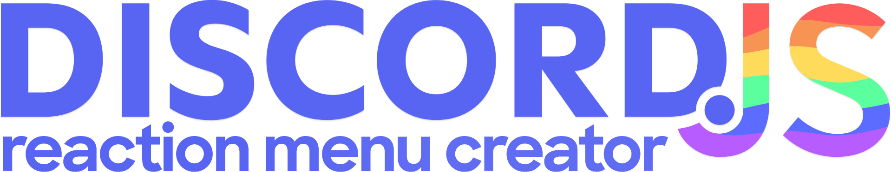

  
     
  Easily create Discord.js embed-menus, with customizable reactions and unlimited pages. 
     
  
  

   

#### This is the dev branch. I'm working on a full TypeScript rewrite/refactor here. The dev branch will eventually become version 3.0.0.

If you have any suggestions, questions or other enquiries about the dev branch, please don't hesitate to ask them in [#support](#user-content-discordbadge).

---

Some of the dev branch's main changes (so far):

- 🧶 Utilises Yarn 3
- 🟦 Built in TypeScript

To be clear: I'm still working on this in my free time. I have other hobbies and duties to take care of besides this. Please give me some time. Thank you.

---

#### 🧶 A note on Yarn 3

By default, the Yarn SDK for VSCode is included. Be sure to select "Use workspace TypeScript version" when you load the repo. If you don't use VSCode, please see [this article](https://yarnpkg.com/getting-started/editor-sdks).
